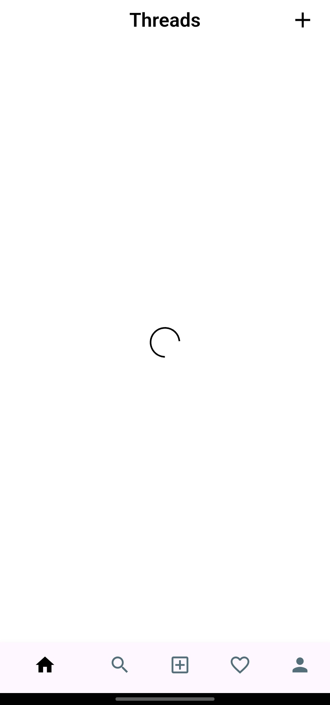
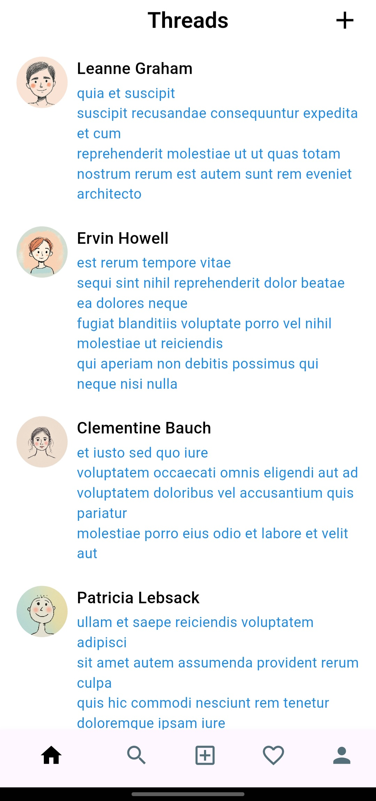
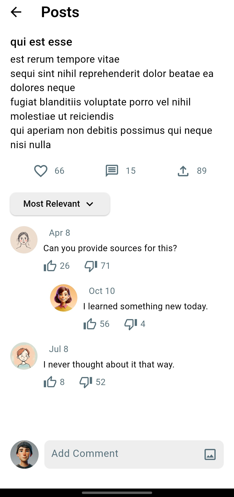

# Threads Listing App 🧵

A minimal **Threads Listing** Flutter application built with **Flutter**, **Provider**, and REST API integration using **http**.  
The app allows users to view posts, comments, likes, and a responsive UI with a bottom navigation bar.

---

## Features 🚀

- **Posts Feed** 📰  
  - View a list of posts fetched from APIs.  
  - Posts display user avatars, names, and body content.  
  - Tap on a post to see detailed post content and comments.

- **Comments** 💬  
  - Placeholder avatars and randomized content for demonstration.  

- **Interactions** ❤️  
  - Like/dislike buttons for posts (UI only).  
  - Upload button placeholder.

- **Navigation** 🧭  
  - Bottom navigation bar with tabs: Home, Search, Add Post, Favorites, Profile.  
  - Uses **BottomNavBarProvider** with Provider for managing selected tab state.
  
- **State Management** ⚡  
  - Uses **Provider** for managing post and user data state.  
  - Handles loading, errors, and refreshing posts via `PostsProvider`.  

---

## Code Structure & Pattern 🧩

- **Provider Pattern**: Used for state management (PostsProvider, BottomNavBarProvider).  
- **Separation of Concerns**: Screens, providers, widgets, and utils are organized into separate folders. 
- **MVVM-Inspired Architecture**: Models represent data, Providers act like ViewModels, and Screens/Widgets act as Views observing state changes.

---

## 📸 Screenshots

### **Home Screen**
> Shows a list of posts with user avatars, names, and post previews.  
<p>


</p>

### **Post Screen**
> Displays the full post title, body, likes, comments, and interactive buttons.  


## Dependencies 📦

This project uses the following dependencies:

- [`provider`](https://pub.dev/packages/provider) – State management for posts and navigation.  
- [`http`](https://pub.dev/packages/http) – Fetch data from APIs (e.g., posts, users).  

---

## Tech Stack 🛠️

- **Flutter** – Cross-platform mobile UI framework.  
- **Dart** – Programming language for Flutter apps.  
- **Provider** – Simple and scalable state management.  
- **VS Code** – Development environment.  
- **Git** – Version control.

---

## Setup Instructions ⚙️

### Clone and Run
```bash
git clone https://github.com/muhammadXainAhmad/threads_listing_api_flutter.git
cd threads_listing_app
flutter pub get
flutter run
```

## License 📄
This project is licensed under the [MIT License](LICENSE).
